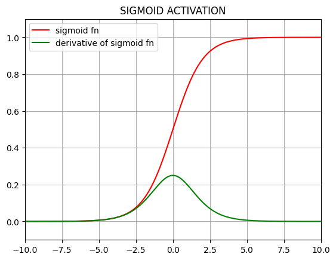
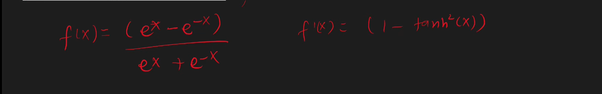
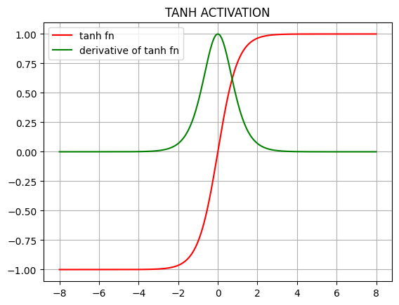
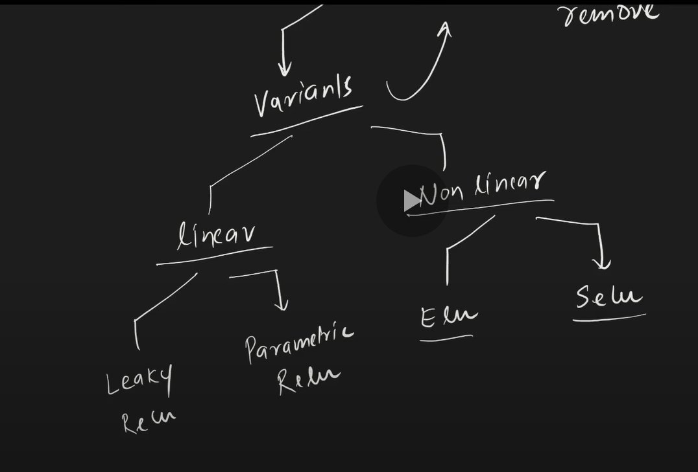
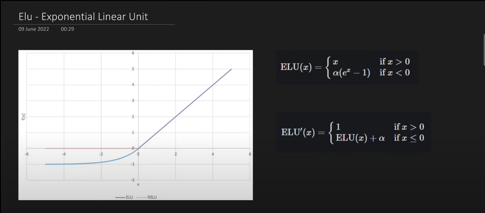

# Activation Functions

    - Activation function should be non linear
    - Activation function should be differentiable
    - Activation function should not be computationally expensive
    - Derivative calculation for activation function should be fast, easy and efficient
    - Activation function should be ZERO CENTRED (eg: tan_h)
        - Mean of Activations ~= 0
    - Activation function should be non saturating
        - Saturating activation functions: sigmoid, tanh ==> squeeze the inputs within a certain range
        - Saturating functions cause VANISHING GRADIENTS
        - Non Saturating activation functions: relu ==> DO NOT squeeze the inputs within a certain range

   

# Types of Activation

## LINEAR

  

## SIGMOID
  

$\sigma(x) = \frac{1}{1 + e^{-x}}$

    - Range: (0, 1)

    - Advantages
        + Range is [0, 1]: can be modelled as probability
        + Non linear function
        + Differentiable

    - Disadvantages
        + Saturating function, hence leads to vanishing gradients
        + Sigmoid activation is NOT ZERO CENTRED
        + Computationally expensive
  

## TANH
  

    - Range: (-1, 1)

    - Advantages
        + Non linear
        + Differentiable
        + ZERO CENTRED

    - Disadvantages
        + Saturating function, hence leads to vanishing gradients
        + Computationally expensive
  

## RELU
  

    - Range: (0, inf]

    - Best choice for hidden layers

    - Advantages
        + Non linear
        + Non Saturating function in the positive region
        + Computationally inexpensive
        + Convergence is faster than sigmoid and tanh functions

    - Disadvantages
        + Not differentiable at 0
        + NOT ZERO CENTRED ==> Use batch normalization
        + Dying ReLU

### Dying ReLU Problem
    - Some neurons always output 0
    - They become dead neurons
    - Once a neuron is dead, it's forever dead
    - If some negative input is given, the derivative becomes 0, which stops updation of weights

    - It can occur in two situations:
        + learning rate is too high
        + high negative bias

    - Solutions:
        + Set a lower learning rate
        + Set a positive bias (0.01)
        + Don't use ReLU
    
  

## Leaky ReLU

    - Range: (-inf, inf)

    - the factor could be 0.1 or 0.01 or some other small value

    - Advantages
        + Some small gradient keeps flowing in the system even for negative values
        + NON SATURATED
        + Computationally inexpensive
        + NO DYING ReLU
        + Close to ZERO CENTRED (NOT PERFECT though)

    - Disadvantages
        + 
        + 
        + 
  

## Parametric Relu

    - Range: (-inf, inf)

    - a is a trainable parameter, hence can be tuned according to given data

    - Best choice for hidden layers

    - Other things are similar to Leaky ReLU
  

## Exponential Linear Unit

    - Range: (-a, inf]

    - a is generally between 0.1 to 0.3

    - Advantages
        + Performance was better than ReLU 
        + Always continuous and differentiable, even at x=0
        + CLose to ZERO CENTRED, hence convergence is faster
        + NO DYING ReLU

    - Disadvantages
        + Computationally expensive
  

## Scaled Exponential Linear Unit

    - Range: (0, inf]

    - a and lambda are not trainable, they are fixed parameters

    - Advantages
        + Self normalizing function, hence converges faster
            + mean ~= 0, std ~= 1
        + All other things are similar to ELU

    - Disadvantages
        + Not thoroughly researched
  