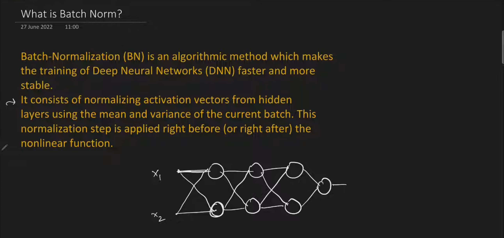
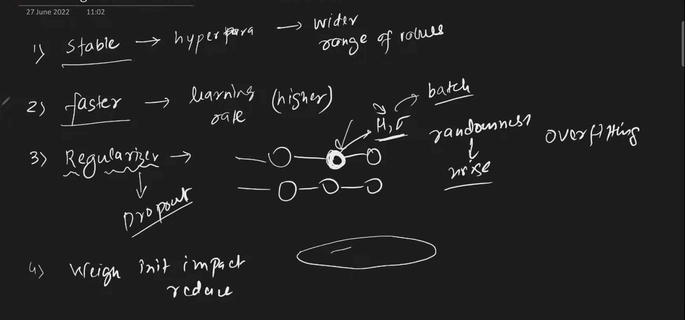

# Batch Normalization

## Covariate Shift and Internal Covariate Shift

    - Basically, it is normalizing the intermediate activations from the hidden layers
    - Reduces internal covariate shift
    - Use mini batch gradient decsent with batch normalization
    - Applied on a layer by layer basis

## IMP

    - Normalization can be applied before activation (more popular)
    - Normalization can be applied after activation as well
    - Normaization mu and std is calculated for one batch of activations for an individual neuron
    - The mu and std data is for a particular neuron, the different values are from the same batch

    - Sometimes, batch normalization is not required, so we use gamma and beta for flexibility
    - After normalization, the values are transformed as gamma times z(n) + beta
    - gamma and beta are learnable params, defined separately for each neuron

## Batch Normalization during Test

    - During test time, only one input as there, so there is no mu or std
    - So we maintain <b>Exponentially Weighted Moving Averages (EMWA)</b> for mu and std, and use them at test time
    - EMWA mu and std are not learnable

## Benifits

## Keras implementation

## Summary
    - At each batch normalization layer
    - There are 4 params for each neuron
    - Two learnable, gamma and beta
    - Two non learnable, EMWA mean and std