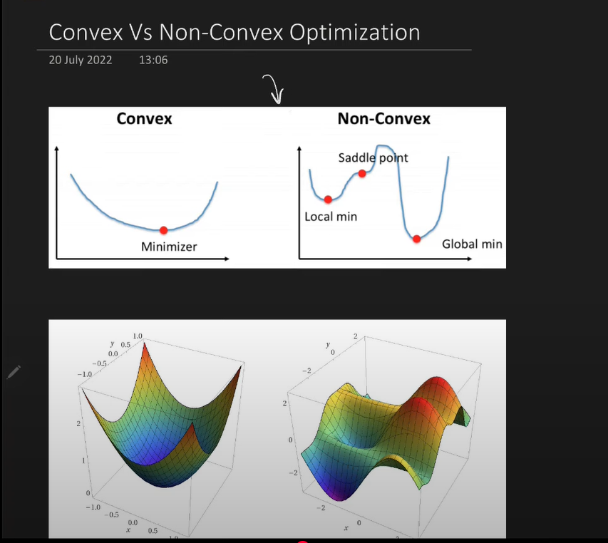

# SGD with Momentum

## Some Graphs

## Convex vs Non convex graphs

## Problems in Optimization
    1. Local minima
    2. Saddle point
    3. High curvature
    4. Consisten or noisy gradient

## Momentum helps solve 
    - Benifit: SPEED
    - High curvature, consistent gradients, and noisy gradients (local minima)
    - Agar pehle k gradients ek particular direction me leja rhe hain, to us direction me or tezi se jao

## Mathematical Formulation

    - beta is called the decay factor