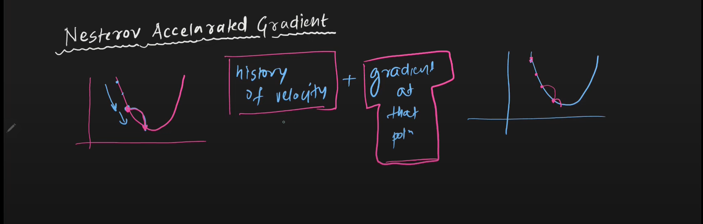
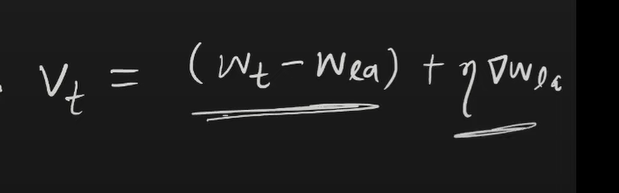

# NAG
    - Kind of a damped oscillation
    

    - First the update happens using velocity (momentum term)
    - Then, the update happens using the gradient at new location

## Look ahead term

## Disadvantage
    - May lead to being stuck in local minima