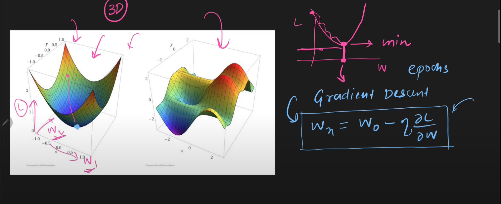

# Optimizers in Deep Learning

- Most commonly used optimizer is GD
- Types of GD: Batch, Stochastic, Mini batch
- Prerequisites
    - EMWA (Exponentially Weighted Moving Average)
    - Understanding of Graphs

# Challenges in GD
- Deciding an optimum value of learning rate
- Learning rate scheduler, predefined values of learning rate
- Same learning rate in all directions, this may result in slower convergence
- Local minima, we may get stuck in local minima sometimes and get a sub optimum minima
- Cannot tackle Saddle point

# Exponentially Weighted Moving Average
- Used in time series forecasting, financial forecasting, signal processing
- Used in momentum optimizer
- The latest data points have higher weights as compared to the earlier points
- The weightage of previous points decays over time

## Formula

- V is the EWMA
- Theta is the independent variable
- Beta is the param (0 to 1)
- The EWMA can be thought of as noraml average of last 1/(1 - beta) days
    - Jitna jyada beta ka val, purame points ko utna importance
    - Beta ka val lkam --> latest points k nazdeek line hogi
- Generally, beta is 0.9 in DL algorithms and optimization problems

# Some Graphs
## Types of Graphs/Plots

## Convex vs Non convex graphs

# Summary
## Types of Optimizers
- 1. Momentum
- 2. NAG
- 3. Adagrad
- 4. RMS Prop
- 5. Adam

## Keras Implementation

- Momentum=0, Nesterov=False ---> SGD
- Momentum=0.9, Nesterov=False -> SGD with Momentum
- Momentum=0.9, Nesterov=True --> NAG 

## Thumb Rule
- Start with Adam
- Then try RMSProp
- Hyperparameter tuning

# 1. SGD with Momentum
## Problems in SGD Optimization
- Local minima
- Saddle point
- High curvature
- Consistently same or noisy gradient

## Momentum helps solve 
- Benifit: SPEED
- High curvature, consistent gradients, and noisy gradients (local minima)
- Agar pehle k gradients ek particular direction me leja rhe hain, to us direction me or tezi se jao

## Mathematical Formulation
### Wt+1 = Wt - Vt, where
### Vt = $\beta$*Vt-1 + $\eta$*$\nabla$ Wt
### => Wt+1 = Wt - $\eta$*$\nabla$ Wt - $\beta$*Vt-1

- $\beta$ is called the decay factor
- $\beta$ = 0 ----> SGD (no momentum at all)
- $\beta$ = 1 ----> Acts like a frictionless, never converges, always keeps oscillating

# 2. Nesterov Accelarated Gradient NAG
- Builds on SGD with momentuim,
- Kind of a damped oscillation (correction term)
- In SGD, the update happens based on direction of gradient at current point
- In SGD with Momentum, the update happens based on momentum (velocity/history of prev. points to speed up the update) at current point + direction of gradient at same point
- Basically, the two update terms are applied simultaneously 
    - First the update happens using velocity (momentum term)
    - Then, the update happens using the gradient at new location (correction term)
- In NAG, first the look ahead term is calculated (momentum/velocity/history) and a small update happens
- And then, the gradient based update happens based on the partiallyt updated term
- Basically, the same update happens in two steps
    

## Disadvantage
- May lead to being stuck in local minima

# 3. AdaGrad (Adaptive Gradient)
- Learning rate is not kept fixed, it adapts according to dataset
- Works better when
    - Scale of input features is different across columns
    - Features are sparse (Most of the values are 0), leading to elongated bowl problem
    - Sparse features ---> more elongated, Non Sparse features ---> more circular

## Sparse features cause elongated bowl problem
- Sparsity in a feature leads to slower updates of the corresponding params

## Adaptive Learning Rate
- Learning rate is different for each trainable param
- Adjust the lr of a param to a smaller value if the gradient is too large
- Adjust the lr of a param to a larger value if the gradient is too small

## Mathematical formulation

- Epsilon is a very small no., kept just to avoid 0 in denominator

## Disadvantage
- Adagrad reaches near the soln, but fails to reach exactly there
- As the epochs increase, the gradients accumulate leading to smaller learning rate
- This prevents the convergence to solution

# 4. RMSProp (Root Mean Squared Propagation)
- Root Mean Square Propagation
- Builds as an improvement of AdaGrad
- The idea is not to consider all past gradients (in order to reduce the accumulated gradient term)

## Mathematical Formulation

- Beta is generally 0.95
- Using EWMA so that only the latest gradients are given importance in accumulation

## No disadvantage
- It's just that adam is better tham RMSProp, RMSProp does not have any problem as such

# 5. Adam (Adaptive Moment Estimation)
- Momentum and NAG work on the principle of momentum/velocity
- AdaGrad and RMSProp work on the principle of changing learning rate
- Adam works on both

## Bias correction
- After calculating Mt and Vt, we calculate bias correction term
