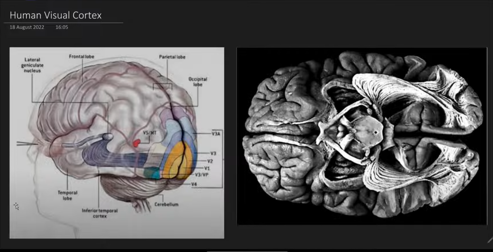

# Convolutional Neural Network
- Inspired by huamn visual cortex

- Why ANNs fail over image data

## Human Brain Visual Cortex and CNN Analogy

## The Cat Experiment

## Types of cell

## Pattern Detection

## Layers in CNN
- Convolutional Layer
- Pooling Layer
- Fully Connected Layer

# Baiscs of Images

## Gray Scale Images
- Grid of values from 0 to 255 (or normalized by /255)
- 0 means Black
- 1 menas White

## RGB Images
- 3 channels
- Eg: Red, Green, Blue (228, 228, 3)
