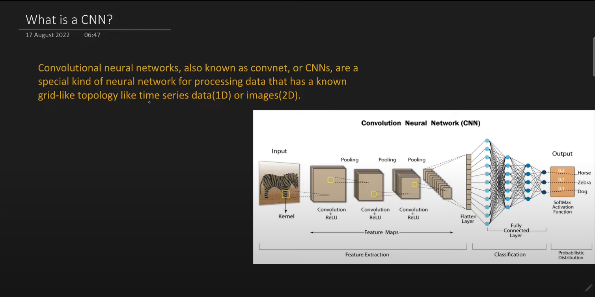

# Convolutional Neural Network

    - Inspired by huamn visual cortex

    - Why ANNs fail over image data

## Layers in CNN

    - Convolutional Layer
    - Pooling Layer
    - Fully Connected Layer

