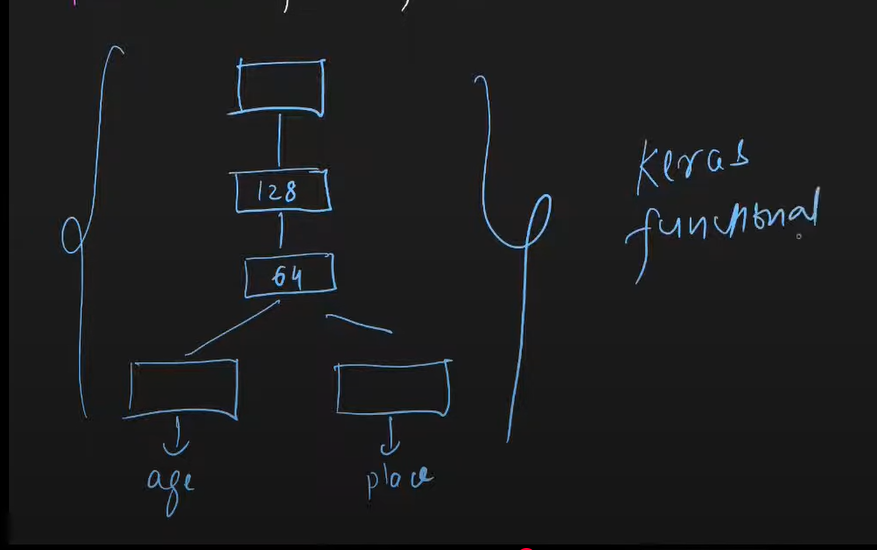

# Functional APIs (MUlti input and multi output models)

## Blog Link
https://machinelearningmastery.com/keras-functional-api-deep-learning/

## Problems in Sequential Models
    - Exactly one input, Exactly one output
    - (Linear Topology) All layers are linearly attached with each other

## Multi Output Scenario
    - Given the image of human beings
    - Predict their age (regression problem)
    - Predict their emotion (classification problem)
    - Predict their nationality (classification problem)

## Multi Input Scenario
    - Given, the image of products (image data, CNN works better)
    - Given, the metadata of products (tabular data, classes of data, ANN works better)
    - Given, the textual description of products (text data, RNN works better)
    - Predict the price of product

## Problem 1
    - Given: Yearly salary, Height, Maritial status
    - Predict: Age, State (Delhi/Mumbai)

## Problem 2

## Problem 3
    - [Given the images of 20000 persons](https://www.kaggle.com/datasets/jangedoo/utkface-new)
    - Predict the age and gender