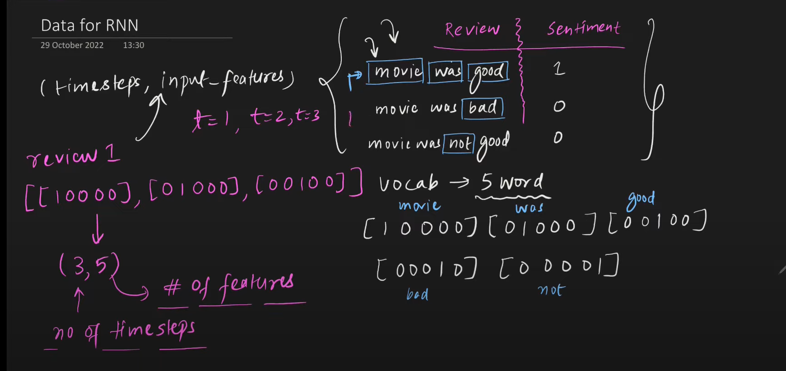

# Architecture and Forward Propagation in RNNs
    - Unlike ANNs (where all data is fed at once), RNNs take input based on timestamps
    - ANN is a feed forward network, RNN has a state which provides feedback to previous layers

## Data structure for RNNs
    - (batch_size, time_steps, input_features)

## Forward Propagation
    - Input is fed according to timestamps
    - At time t=1, only x11 is fed, at t=2 x12 is fed and so on
    - When the forward prop for t=2 happens, the network recieves two inputs x=12, and the outputs of the previous activations from the same layer
    

