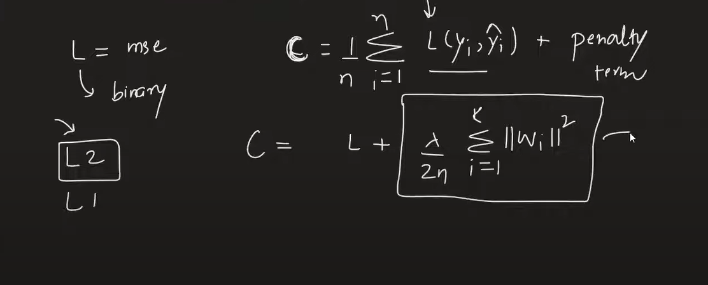

# Regularization
    - Helps reduce overfitting
    - Try applying regularization whenever overfitting occurs

## L1 Regularization
    - Penalty is the L1 norm
    - The penalty is the sum of mod of weights
    - L1 regularization gives a more sparse model than the L2 regularization

## L2 Regularization
    - Most commonly used
    - Also called as weight decay parameter
    - Penalty is the L2 norm
    - The penalty is the sum of square of weights
    - The biases are not considered in regularization
    - Lambda is a hyperparameter
    - Increasing lambda increases the weightage of regularization penalty in the loss function

## L1 + L2 Regularization

