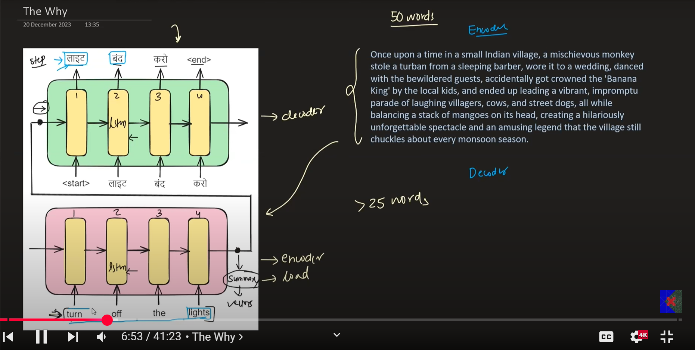
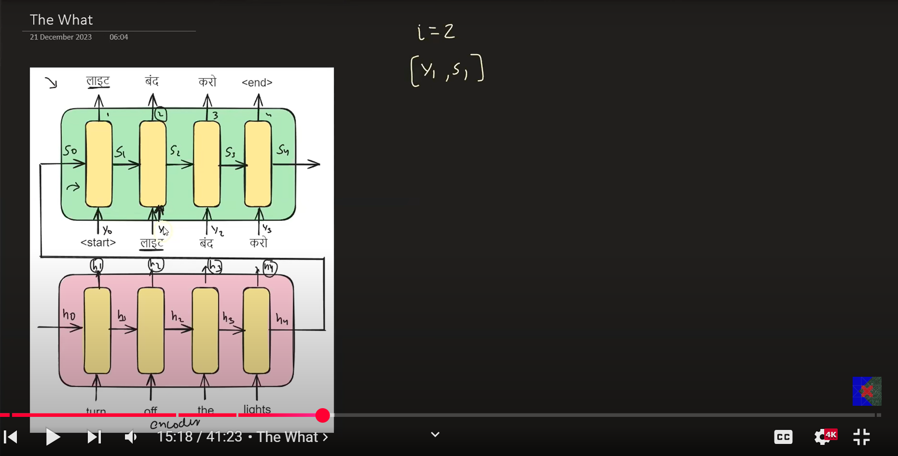

# Attention Mechanism

## The WHY

- The encoder decoder architecture suffers from retaining long contexts, when, for exaample, the sentences are really long
- It creates a lot of pressure on the context vector to store all information about the input. The context vector often fails here
- Also, for some of the words in the translation task, we do not need the entire sentence for some timestamps, only certain words could have helped
- For each timestamp, we want a set of words which are useful for predicting the output of that timestamp
- The context vector is a static representation of the input features
- Having the set of words necessary for each timestamp helps solve the problem dynamicaly

## Notation and The WHAT

At a general timestamp t, we need need St-1 and yt-1 

- Ci: Attention input
