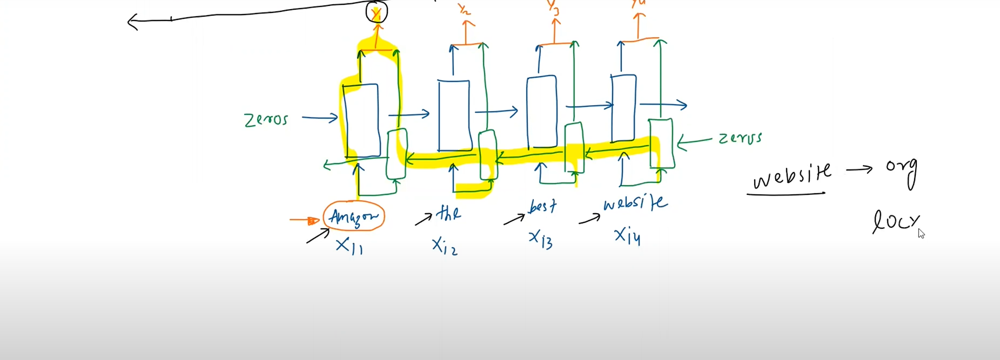

# Bidirectional RNNs

- Sometimes, the future inputs may have effect on outputs of previous timestamps
- In such cases, unidirectional RNNs fail and we must use bidirectional RNNs
- Eg: I love amazon, it's a great river. I love amazon, it's a great website.
- NER on the above statment reckons that to know what kind of entity amazon is, we must read the later part of the sentence

## Notation and Representation

- We basically use two RNNs, one for the forward direction, the other for the backward direction
- At the end, the output is concatenated

## Applications
- NER (Named Entity Recognition)
- POS (Parts of Speech Tagging)
- Machine Translation
- Sentiment Analysis
- Time Series Forecasting

## Disadvantages
-  Increases the model complexity, doubles the number of parameters
- Sometimes, we may have to process data even before the complete data is obtained
- Eg: Speech recognition (BiRNNs fail here, lead to latency in processing)