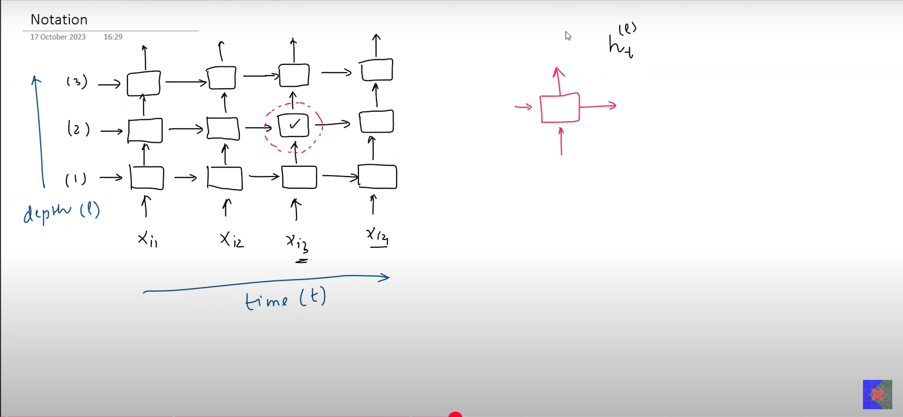

# Deep RNNs (Stacked RNNs)

- Stacking RNN cells over each other is called a Deep RNN
- 

## Notation

## Why and Where to Use DeepRNNs
1. Heirarchical Data Representation (machine translation, complex sentiment analysis, speech recognition)
- It acts like CNNs, where the initial layers find low level primitive features, and the deeper levels find the higher level features relevant for the overall model
- Eg: word --> sentence --> paragraph --> complete_data --> sentiment

2. Complex tasks or when customization is required
- Eg: Creating a machine translation model using attention meachnism with encoder/decoder module
- Google Machine Translation modules use stacked RNNs

## When to Use DeepRNNs
1. Complex Tasks (Eg: speech recognition, machine translation)
2. Simpler models are not giving satisfactory results
3. When we have Large datasets
4. When we have enough Computational Power

## Disadvantages of Deep RNNs
1. Overfitting
- As the architecture is very complex and if enough data is not supplied, it tends to overfit
- May try regularization, dropouts, weights init, learning rate combinations to reduce overfitting

2. Training time increases