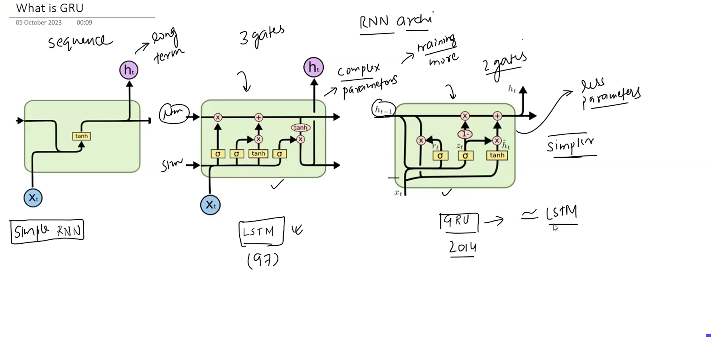
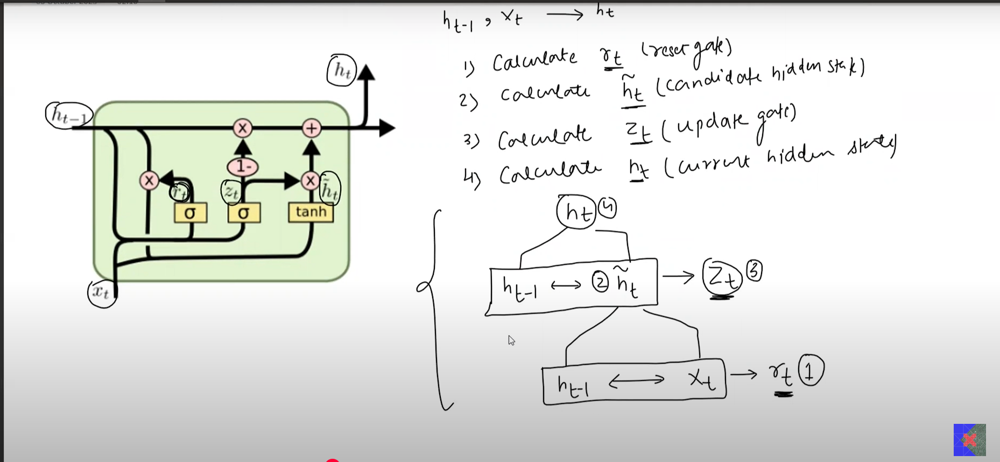

# Gated Recurrent Units (GRU)

- GRUs are simpler architectures than LSTMs (less number of parameters to solve for)
- Because of simpler architecture, the training for GRUs is lesser compared to LSTMs
- Results from GRUs are comparable to LSTMs

## The Idea Behind GRUs
- Only two gates
    - `RESET GATE`
    - `UPDATE GATE`

- No Cell State

- A single hidden state is used to maintain and manipulate both short term and long term context

## The Architecture
1. Input: `Hidden state of the prev. timestamp` and `Input features of the current timestamp`
2. Processing: `Reset Gate` and `Update Gate`
    - Calculate Rt
    - Calculate $\tilde{H_t}$
    - Calculate Zt
    - Calculate Ht
    - 
3. Output: `Calculate hidden state / output for the current timestamp`

## Gates in GRU

- Ht-1: Hidden state of the previous timestamp
- Ht: Hidden state for the current timestamp (or the output of the current timestamp)
- Xt: Input sequence for the current timestamp
- Rt: Output of the reset gate for the current timestamp
- Zt: Output of the update gate for the current timestamp
- $\tilde{H_t}$: Candidate hidden state for the current timestamp

- `Dimensions of all above vectors (except, Xt because it is the input feature) is the same always`
- `Number of units in each neural layers is same for all layers in the GRU`
- `Dimension of intermediate vectors == Number of units in each neural layer`

## RESET GATE

## UPDATE GATE