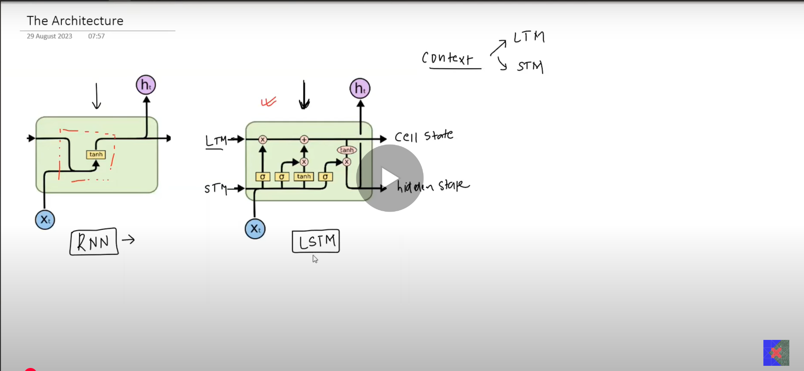
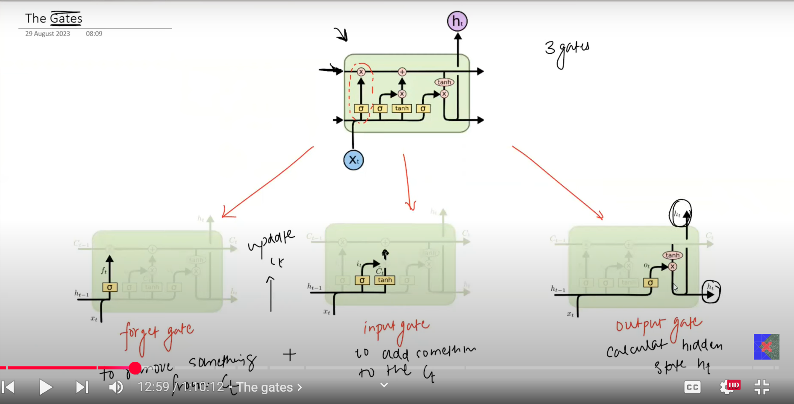

# LSTM Architecture

- `Cell State: ` Long Term Memory
- `Hidden State: ` Short Term Memory

## LSTM is like a small computer
- Input
    - Xit: Input features for current timestamp
    - Ct-1: Cell state (long term context) from the previous timestamp
    - Ht-1: Hidden state (short term context) from the previous timestamp

- Process
    - Update Ct: `Remove unnecessary info` and `Add new info`
    - Calculate Ht

- Output
    - Ct: Cell state (long term context) for the current timestamp
    - Ht: Hidden state (short term context) for the current timestamp

# Gates in LSTM

- FORGET GATE: To remove something from Ct-1
- INPUT GATE: To add something to Ct-1
- OUTPUT GATE: To calculate Ht

## Imp
- Ht and Ct are vectors of equal dimension
- Forget gate has ft
- Input gate has it and $\bar{C}$t
- Output gate has Ot>
- All, H, C, f, i, C, O, are of equal dimensions

## PointWise Operations
Eg: X = [x1, x2, x3] and Y = [y1 y2 y3]
- `Pointwise multiplication(X, Y) = [x1*y1 x2*y2 x3*y3]` 
- `Pointwise addition(X, Y) = [x1+y1 x2+y2 x3+y3]` 
- `Pointwise tanh(X) = [tanh(x1) tanh(x2) tanh(x3)]` 

## Yellow rectangular boxes
- These are neural network layers
- The sign represents the activation of that layer
- The number of nodes in each layer is always equal to each other
- The dimensions of cell state, hidden state, etc is equal to the number of nodes in thd neural layers

# The `FORGET GATE`
- First calculate ft
- ft = sigmoid (Wf . concat(ht-1, Xt) + Bf)
- REMOVAL OF INFO FROM Ct-1: Do a pointwise multiplication of ft with Ct-1

# The `INPUT GATE`
- First calculate candidate cell state ($\bar{C}$t)
- $\bar{C}$t = tanh (Wc . concat(ht-1, Xt) + Bc)
- This is the potential information which can be added to the cell state
- But we filter it further
- Calculate it
- it = sigmoid (Wc . concat(ht-1, Xt) + Bc)
- Now do: it pointwise multiplication with $\bar{C}$t
- ADDITION OF INFO TO Ct-1: Do a pointwise addition of above result with Ct-1
- Now we get Ct

# The `OUTPUT GATE`
- First do a pointwise tanh of Ct
- Then calculate Ot
- Ot = sigmoid (Wo . concat(ht-1, Xt) + Bo)
- Now get ht
- ht = pointwise multiplication of Ot with tanh(Ct)