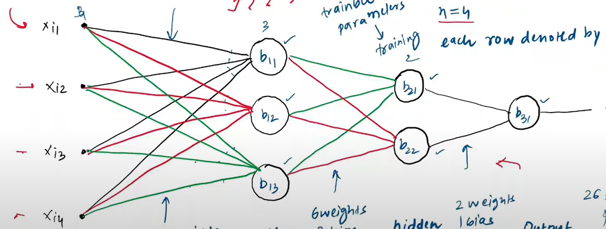

# Perceptron Notation

### Architecture

### Number of Trainable Parameters
    At each level
    Weights = nodes in prev level * nodes in curr level
    Bias = nodes in curr level

### Weights Notation
Wki j

    k: jis weight ki bat ho rhi hai, wo konse layer me ghus raha hai
    i: jis layer se niakl rha h uska node number in that layer
    j: jis layer me ghus rha h uska node number in that layer

### Bias Notation
Bi j  

    i: Layer Number
    j: Node Number in the particular layer

### Output Notation
    Output of a particular node is the Input to the next layer node
    Each node may produce more than 1 output
Oi j  

    i: Layer Number
    j: Node Number in the particular layer

# Multilayer Perceptron
