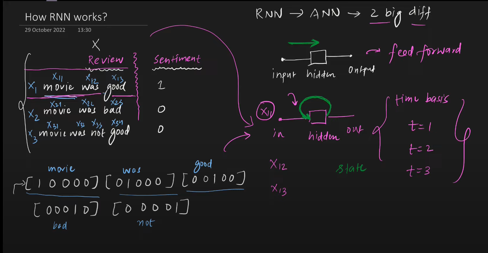
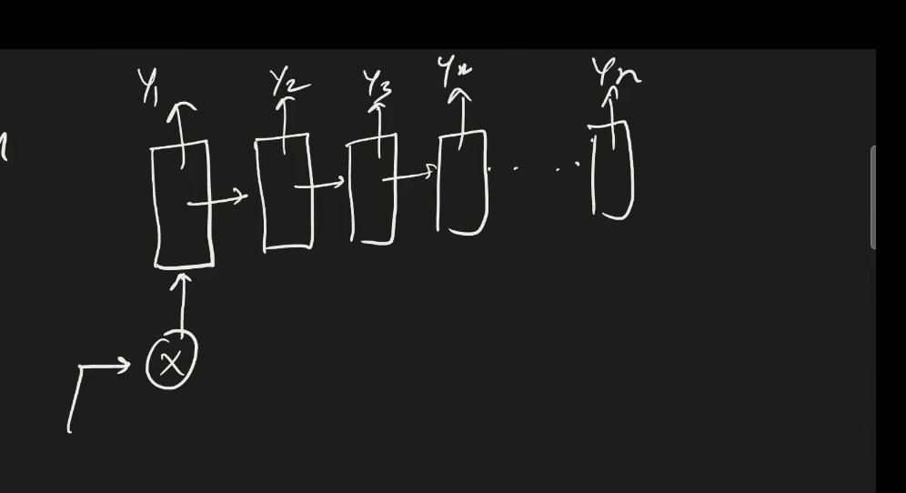

# RNN (Recurrent Neural Networks)
- RNN is a type of Sequential Model
- Works best with sequential data, eg: sentences, time series data, speech, dna
- RNNs are used the most in NLP
- RNNs have a memory feature, which makes them suitable for sequential data

## Why ANNs or CNNs fail on sequential data
- We need to vectorise the data to feed in an ANN
- Textual data (input) can be of varying sizes
- Zero padding leads to unnecessary calculations
- When words are converted to vectors
    - it increases computational cost
    - increases complexity (more number of weights and baises)
- Even if we go ahead, the test data could be of different size (exceeding the input paddings)
- Totally disregarding the sequential information, but the sequence contains some meaning

## Use Cases
- Sentiment analysis
- Sentence completion
- Image caption generator
- Language detection
- Machine translation
- Question Answer agent
- Time series forecasting
- Speech classification

# Architecture and Forward Propagation in RNNs
- Unlike ANNs (where all data is fed at once), RNNs take input based on timestamps
- ANN is a feed forward network, RNN has a state which provides feedback to previous layers
- `A simple RNN can process upto 10 previous timestamps`

## Data structure for RNNs
- (batch_size, time_steps, input_features)

## RNN Architecture
- Input is fed according to timestamps
- At time t=1, only x11 is fed, at t=2 x12 is fed and so on
- When the forward prop for t=2 happens, the network recieves two inputs x=12 (weighted with usual weights), and the outputs of the previous activations (weighted with the weights of the hidden layers) from the same layer
- For the first timestamp, the feedback could be zeros or random numbers
- The recurrent connections also have weights
- `Default activation function of all SimpleRNNs is tanh`

## Forward Propagation in RNNs (Unfolding Through Time)
- Basically means that the recurrent layer works as a loop
- Uses concept of parameter or weights sharing
- Helps process the information in sequences

## Simplified Representation

# Types of RNNs
1. Many to One
2. One to Many
3. Many to Many
4. One to One

## Many to One
- Input: SEQUENTIAL DATA (sentences, time series data)
- Output: SCALAR
- Use case: `SENTIMENT ANALYSIS`, `RATING PREDICTION`

## One to Many
- Input: NON SEQUENTIAL DATA (fed at once, eg: tabular data, images, vectors)
- Output: SEQUENTIAL DATA (generates data in form of timestamps, eg: sequence of words, numbers)
- Use case: `IMAGE CAPTIONING`, `MUSIC GENERATION`
- Architecture is just opposite of the `Many to One`
- 

## Many to Many (Sequence to Sequence Model)
- Input: SEQUENTIAL DATA
- Output: SEQUENTIAL DATA
- Two types
    1. Same length (input sequence size == output sequence size) many to many  
        Use case: `PARTS OF SPEECH TAGGING`, `NAMED ENTITY RECOGNITION`
    2. Variable length many to many (Also called `encoder - decoder` network)  
        Use case: `MACHINE TRANSLATION`

## One to One
- Not an RNN
- Input: NON SEQUENTIAL DATA (fed at once)
- Output: NON SEQUENTIAL DATA (output at once)
- Use case: `IMAGE CLASSIFICATION`