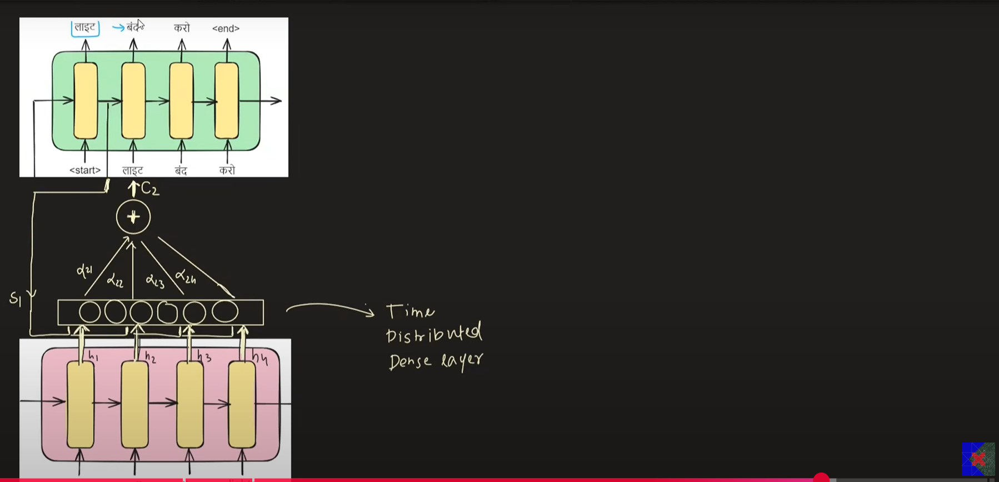
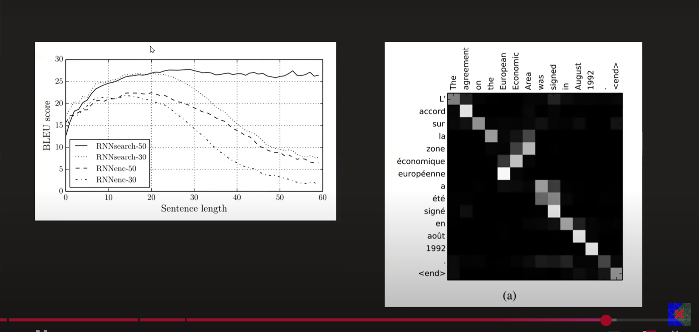

# Attention Mechanism

## The WHY

- `ENCODER PROBLEM:` The context vector (which is produced by the encoder block) has all the responsibility of retaining the context of the input and send to the decoder block
- For very large input sequences, the context vector often fails here to achieve good results

- `DECODER PROBLEM:` - At each timestamp in the translation task, we do not need the entire input sentence, only certain words (or a set of wards) could have helped predict the output of that specific timestamp

- This is basically focusing the attention on the specific input points that are most relevant for that timestamp
- Moreover, attention provides dynamic information about the most important features for a particular timestamp prediction

## Notation and The WHAT
- At a general timestamp t, we need need St-1 and yt-1 
- Now we provide an additional information (called the `attention input`), which is nothing but tells us what is the most critical input feature for predicting the output at timestamp i

- Ci: Attention input (the set of most important input features for making the prediction at timestamp i)
- Ci is a vector equidimensional with hidden state (context vector) of the encoder-decoder blocks
- $C_i = \sum \alpha_{ij} h_j$
- $ \alpha $ is called alignment score or similarity score
- $ \alpha_{ij} $ depends on Si-1 and hj

## Trainging and Backpropagation
- The alphas are calculated using a separate RNN layer

# Benifits
- `NOTE: `The actual research paper had used 4 layers of BiDirectional LSTMs
- The BLUE score decreases beyond 30 words without attention
- The BLUE score remains stable even beyond 30 words
