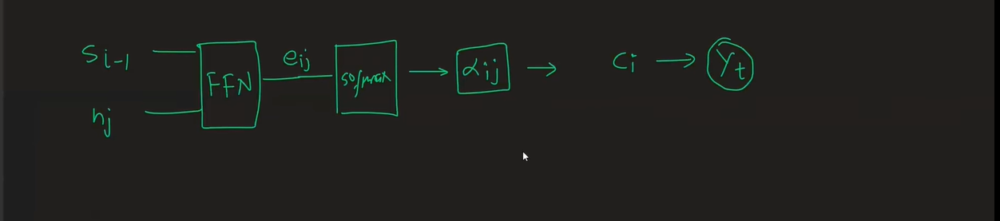
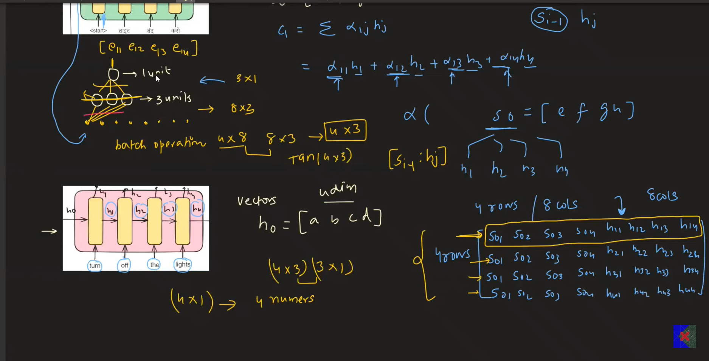
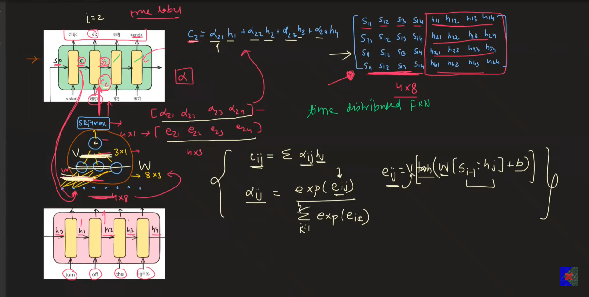
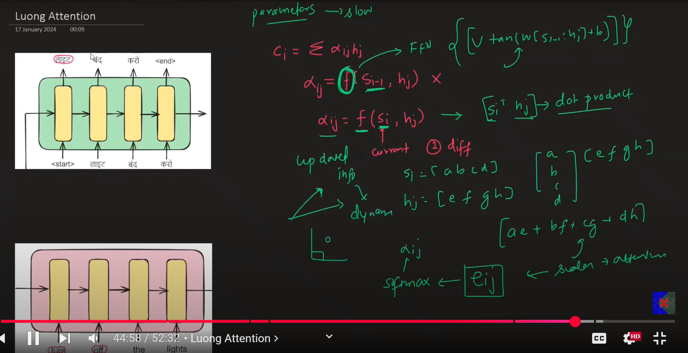
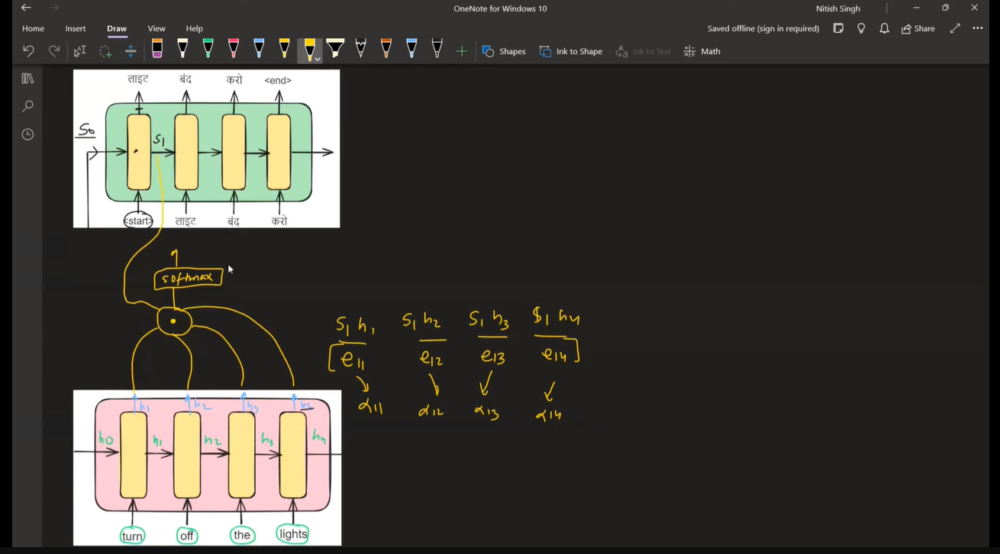

# Bahdanau Attention vs Luong Attention
- These are different ways to calculate the alignment scores
- $ \alpha_{ij} $ depends on Si-1 (deocder previous hidden state) and hj (encoder hidden state)
- $ \alpha_{ij} = f(S_{i-1}, h_{j}) $

## Bahdanau Attention (Additive Attention)
- The function f is approximated using a RNN called `time distributed Fully Connected Layer`

- The new architecture looks like

## Luong Attention (Multiplicative Attention)

- The idea is to eliminate the neural network layer for calculation of the similarity scores
- So we use a simpler method of just using dot products to find the similarity score
- Also instead of using the decoder previous hidden state, we use the decoder current hidden state to calculate the alphas
- The idea here is to use more updated(recent) state to get more dynamic alphas
- The attention inputs are passed during the last output prediction of the decoder block
- The raw output of the decoder block is concatenated with the attention inputs from Luong and then passed to the softmax layers