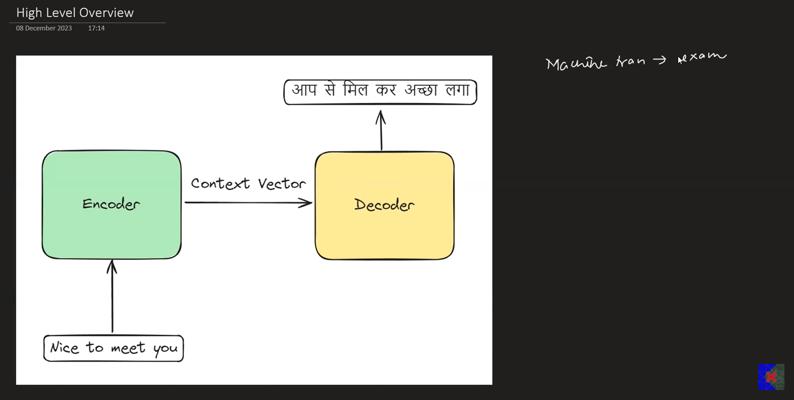
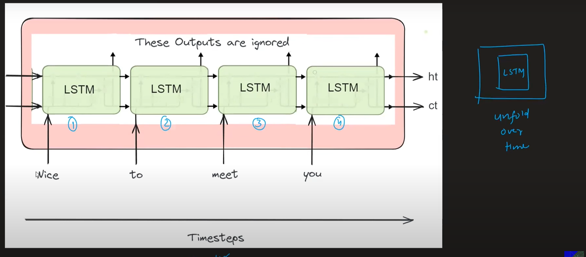
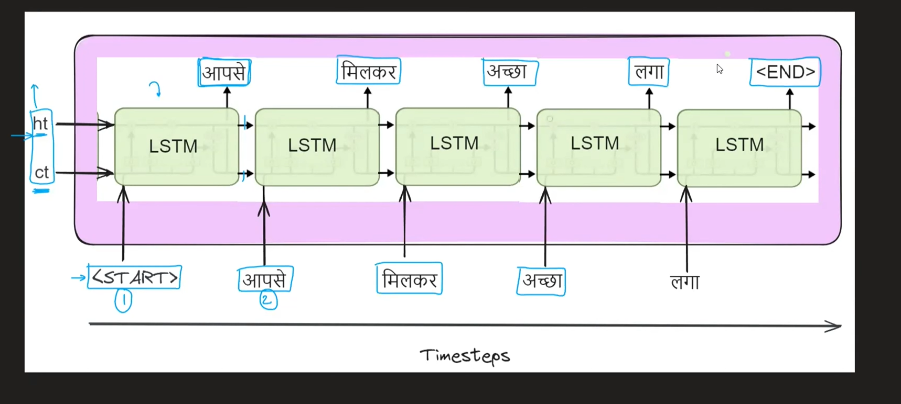
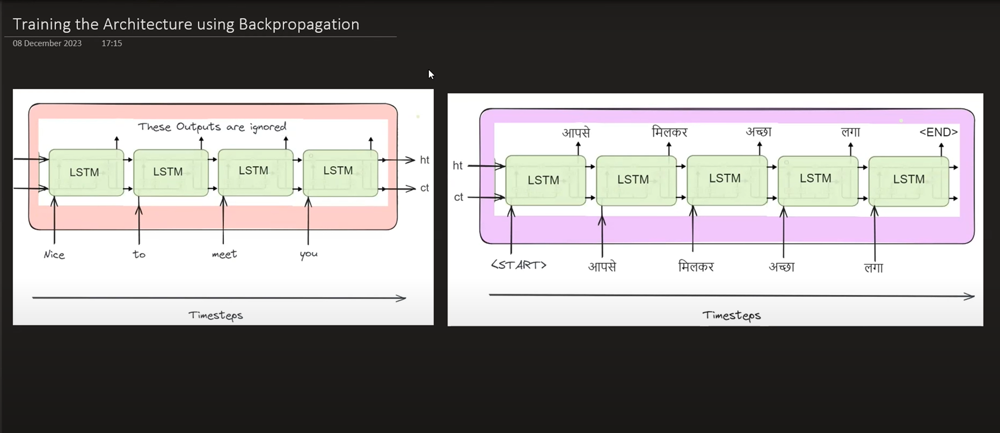

# Encoder - Decoder Models or Sequence2Sequence Models

## Challenges in Seq2Seq Problem Statements
Eg: Machine Translation Eng --> Hindi
- Variable length inputs
- Variable length outputs
- No guarantee that input_len == output_len
- 

## High Level Overview

- Training of weights and bias happens together for encoder and decoder block