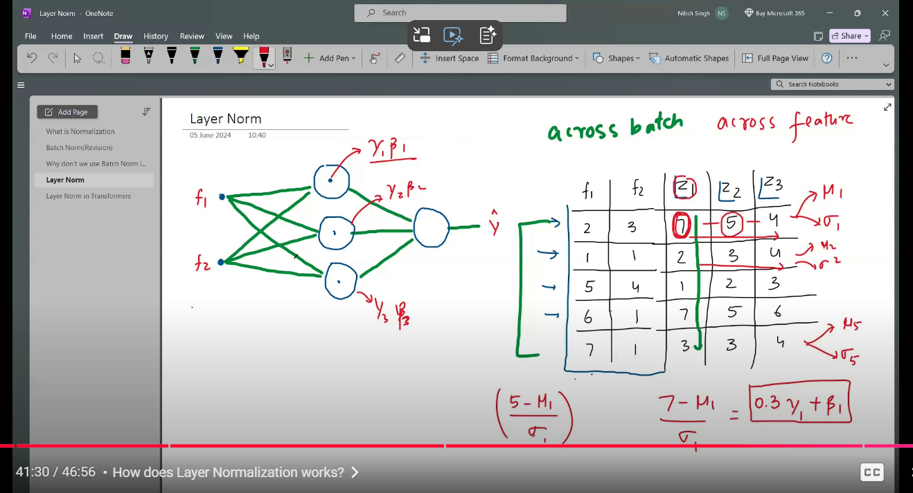
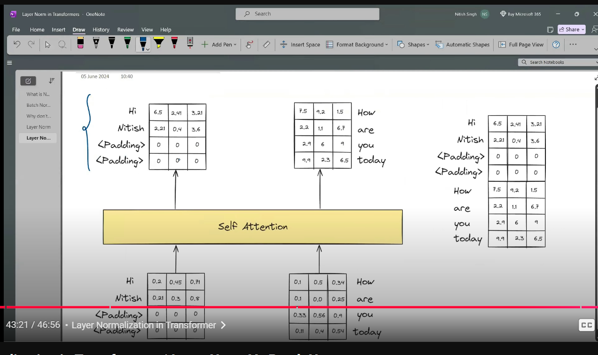

# Layer Normalization
- Normalization can be applied to: 1. Input features, 2. Activations of hidden layers
- Benifits of normalization: 1. Stable training, 2. Faster convergence, 3. Avoids internal covariate shift, 4. Regularization effect of batch normalization

# Batch Normalization is Not Suitable For Sequential Data
- Batch Normalization does not work with sequential data in general
- When passing sequential data in batches, some input data sentences could be of different sizes than the other
- Due to this it is necessary to pad the shorter sequences with zero vectors
- These newly introduced zero vectors are added
- When applying batch normalization, these zeros are not part of the real data so the mean and std is not a true representation of the actual data

# Layer Normalization
- Batch normalization is applied to the output of a single node, across multiple datapoints of the batch
- Layer normalization is applied to different outputs at the same level layer

## Why It Works In This Case
- The outputs of the zero padded vectors are always zero and hence they do not affect any other values in the data
