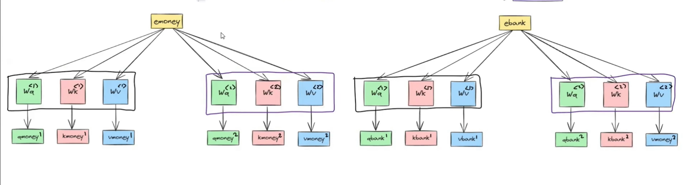
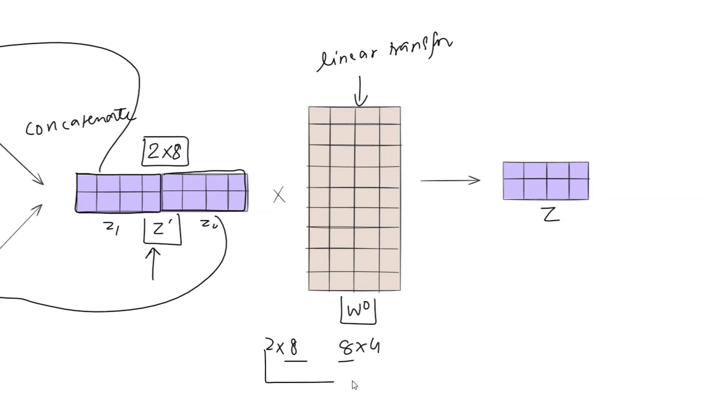

# Multihead Attention

- Multihead attention is an extension of the self attention

## Problem with Self Attention
- Is some data (eg: an english sentence `THE MAN SAW AN ASTRONOMER WITH A TELESCOPE`) have multiple meanings, the self attention fails to capture multiple perspectives
- So we simply add more heads to generate more Weight matrices and hence more Q,K,V vectors for each datapoint
- Multi-head Attention enhances the expressiveness and representational capacity of Transformers by allowing the model to attend to different parts of the input data simultaneously. By utilizing multiple attention heads, the model can capture diverse patterns and relationships in the data, enabling more effective information processing and feature extraction. This mechanism enhances the model's ability to handle complex sequences and tasks in natural language processing and other domains.

# Visualization
- Multiple attention heads generate multiple contextual embedding vectors

- After getting all the contextual vectors, they are concatenated
- The concatenated matrix is then multiplied (linear transformation) with Wo to get final contextual embeddings

## Colab Notebook
https://colab.research.google.com/drive/1hXIQ77A4TYS4y3UthWF-Ci7V7vVUoxmQ#scrollTo=YLAhBxDSScmV
