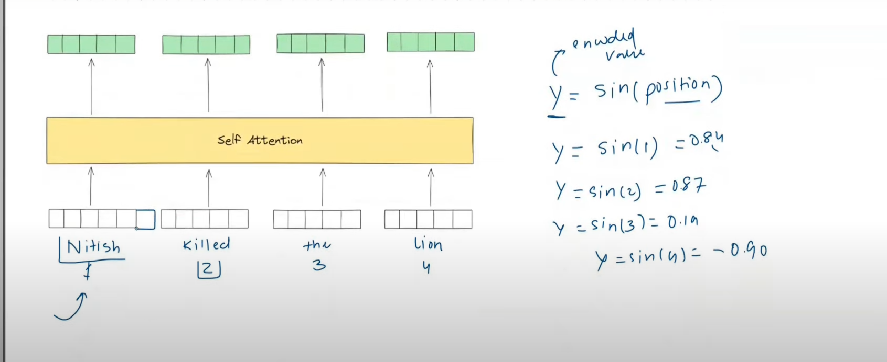
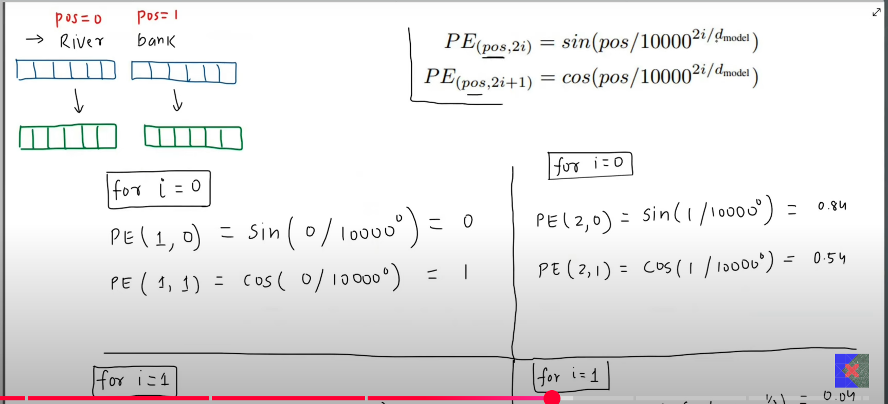
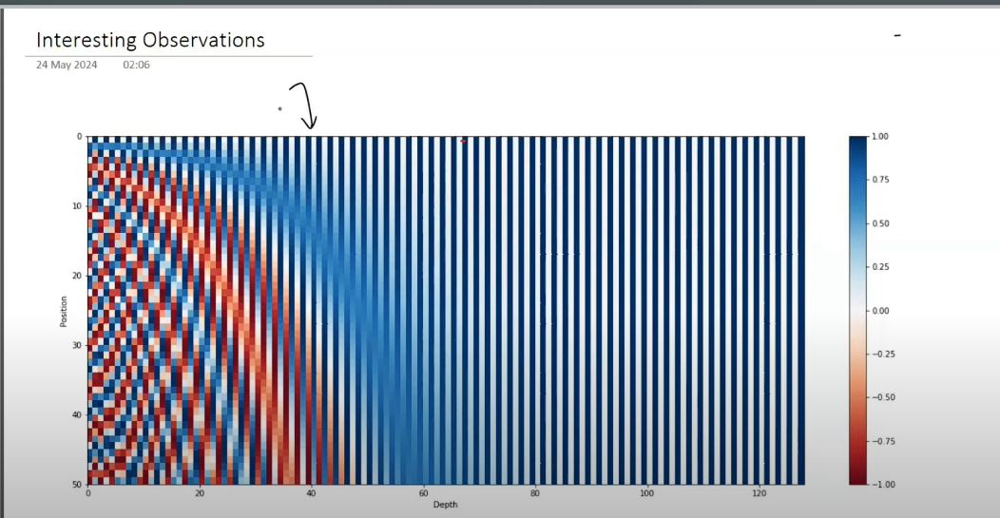

# Positional Embeddings

- The Self Attention does great in figuring out the cotextual meaning (embedidngs) of the words
- BENIFITS: `Parallel processing and computations benifits over the inherent sequential nature of all RNNs`
- DRAWBACK: `Does not capture the order of the words at all`
- Eg: Kaushal Killed Lion, Lion Killed Kaushal
- Both these sentences will have the same contextual embeddings and no information about order is captured
- Somehow we need to tell the self-attention module about the position of the words in a sentence

## Why Not Simply Pass The Position Numbers
- `RAW APPROACH`: Simply pass the positoinal numbers as 1, 2, 3, 4, 5, to the embedding vectors and then feed to the self attention layer

Problems
1. These numbers are unbounded, that is, they do not have any upper limit
- Of course we could normalize this but it will lead to inconsistent representation for same positions across differetn sentences in the dataset
- Eg: Thank: 1/2 = 0.5 You: 2/2 = 1
- Nitish: 1/5 = 0.2 Singh: 2/5 = 0.4 Killed: 3/5 = 0.6 The: 4/5 = 0.8 Lion5/5 = 1
- This creates inconsistent representation for second, third, etc, words in the same dataset
2. The numbers 1, 2, 3, 4, .... are discrete and lead to numerical instability
3. This approach fails to capture relative positioning between any two words

## Sin and Cos based positional encoding
- Use periodic function such as sin or cos to encode
- This maked the values bounded, solves the problem of discrete values and also captures the relative positioning
- But still, since sin is periodic the values obtained are repetitive and lead to duplicate encodings for two different words
- So we use a combination of sin and cosine

## Attention Is All You Need

- Increasing the number of combinations decreases the possibility of repeating values
- Each word has dimensions of positional encoding exactly equal to the dimensions of the embedding vector
- After generating the positional encoding, we do vector addition of embedding vector and the positioning encoding
- The resultant is then fed to the self-attention layer

## Why Vector Addition Instead of Concatenation
- Concatenation will lead to double parameters, increasing complexity and training time

## How It Captures Relative Positioning

[Capturing The Relative Positioning of Vector](https://www.youtube.com/redirect?event=video_description&redir_token=QUFFLUhqbldub2ZFQmpyQlpzSlc3ekZDeVAtLWVnbHpqQXxBQ3Jtc0tuWHptb2FNVFA5dVdyMTcyZENsbVFTU0E3WFMwT0VQYkNvUVJWbjFOMmFuaEd2dm5KRFNIRnQtU1B5R0tKRjFKR0VCcmpMSndHUzBNVTFGZ3hKenY1R0kxSHJWeUxiYmlsTVFvTjJ5U3RBdXJab25JRQ&q=https%3A%2F%2Fblog.timodenk.com%2Flinear-relationships-in-the-transformers-positional-encoding%2F&v=GeoQBNNqIbM)