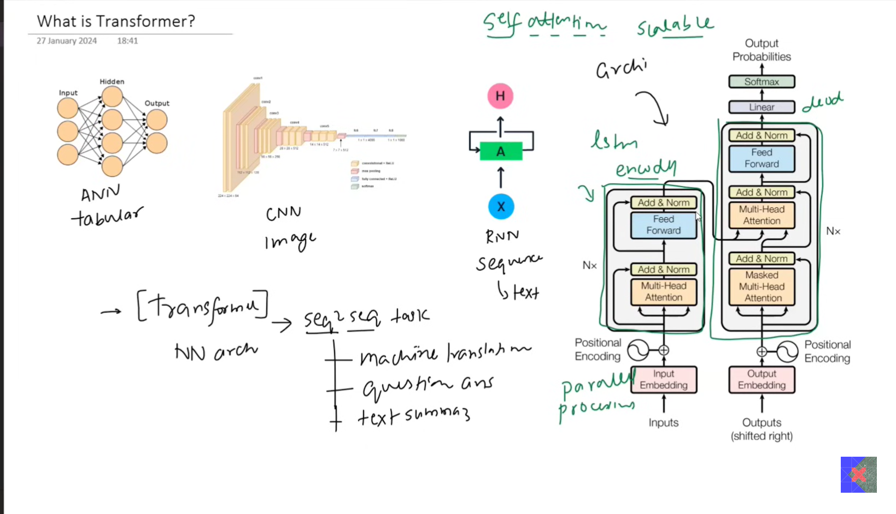
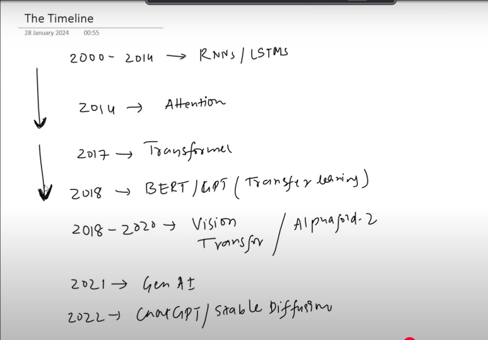

# TRANSFORMERS

- It is useful for Seq2Seq tasks
- Eg: machine translation, question-answering, text summarization
- We do not use LSTM based encoder-decoder blocks
- We rather use self attention based encoder-decoder blocks
- This helps in parallel processing of input data, due to which the model can be easily trained on very large datasets

## Research Paper
[Paper - Attention Is All You Need](<Attention Is All You Need.pdf>)
- Uses self attention instead of LSTM cells -> parallel training
- many smaller components (networks) which provide stability to model
- stable hyperparameters robust to different tasks

## Impact Of Transformers
1. Revolution in NLP domain (state of the art results on all NLP tasks)
2. Democratizing the AI
3. Multimodal capabilities (handling inputs and outputs in different formats)
4. Acceleration of GenAI
5. Unification of Deep Learning (Transformers works for all including NLP, GenAI, computer vision, reinforcement learning)
6. Scalability to train on very big datasets
7. Transfer learning
8. Flexible Architecture (Encoder only: BERT, Decoder only: GPT)
9. Integrable to other AI techniques (eg: GAN + Transformers, Reinforcement Learning + Transformers, CNN + Transformers, Vision Transformers)

## Evolution of Transformers

- The Encoder-Decoder architecture paved way for many sequence to sequence tasks
- Attention made the model even better by retaining longer contexts
- But it still suffered from the curse of sequential training (because of LSTMs)
- Due to this transfer learning can not be used at this stage

## Disadvantages of Transformers
- Requires high computational resources
- Data hungry
- Risk of overfitting
- Energy consumption (hardware, electricity, environmental concerns)
- Interpretability of transformers is not good (like a black box model)
- Bias in data
- Ethical concerns

## Future of Transformers
1. Improvements on model size
    - Pruning
    - Quantization
    - Knowledge Distillation

2. Multimodal capabilities
    - text
    - image
    - speech
    - sensory data and signals
    - biometric feedback such as retina, fingerprints
    - timeseries data

3. Responsible AI development
    - eliminate bias from models
    - ethical, social, government, and environmental concerns

4. Domain specific modelss
    - doctorGPT
    - legalGPT

5. Multilingual models

6. Interpretability
    - understand why a particular output appeared the way it did
