# Self Attention
The singlemost challenge in any NLP task is `vectorization`
- Eg: OneHotEncoding, BagOfWords, TfIdf, etc.
- Word Embeddings: helps capture semantic meaning of the words as well

## Problem with Embeddings
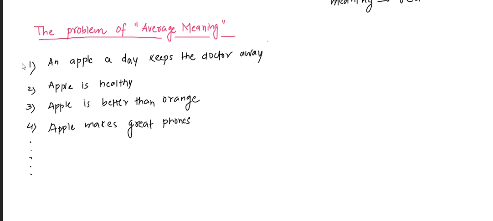
- Word embeddings capture the average meaning of the word
- They are static and depend heavily on distribution of data
- The problem is the word embeddings are created once, but used multiple times, so in some scenarios it loses the meaning due to capturing average meaning
- Hence we need contextual meaning

## Self Attention
- Generates better and smart contextual meaning of words
- Input: Static embeddings
- Output: generate smart, dynamic and contextual embeddings

## How Does Self Attention Work
- Eg: S1=> Money Bank Grows S2=> Bank River Flows
- New Embeddins for Bank S1 = $ \alpha_{1} * Money + \alpha_{2} * Bank + \alpha_{3} * Grows$
- New Embeddins for Bank S2 = $ \alpha_{1} * Bank + \alpha_{2} * River + \alpha_{3} * Flows$
- It introduces the capability to have contextual meaning and understand when a word appeared
- The elements on RHS are rather the old embeddings, the ones on the LHS are new embeddings
- The alphas are nothing but similarity indices
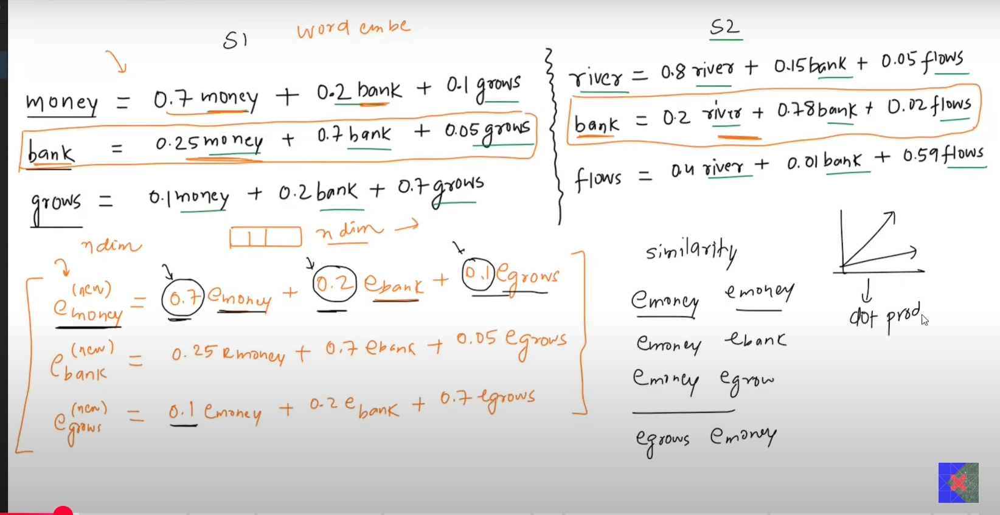
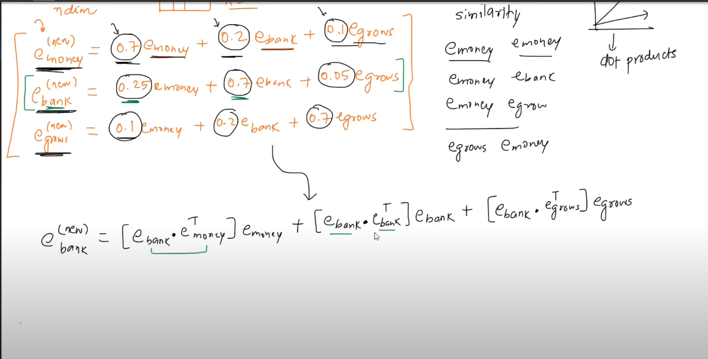
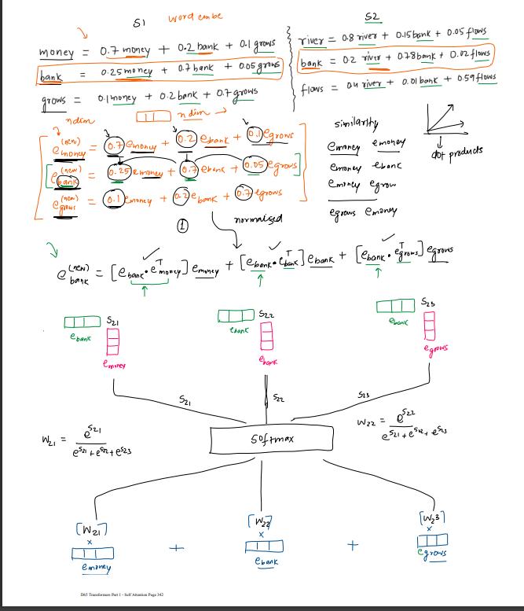
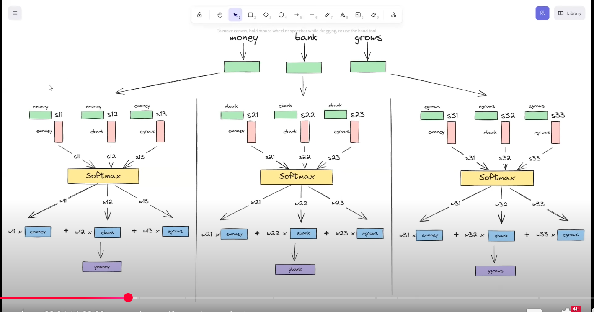
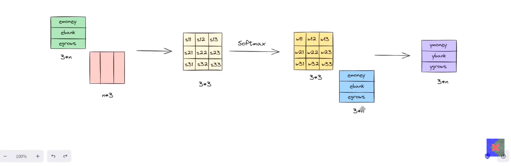

## Points to Consider
- This method parallely computes the embeddings, and hence speeds up training
- No training parameters are involved (speeds up training, but the embeddings thus generated are task independent general embeddings)
- Parallelisation loses the sequential information
- At this stage, there is a need to introduce weights and biases

## Contextual Embeddings
- Every vector has three roles to play
1. Query 
2. Key
3. Value
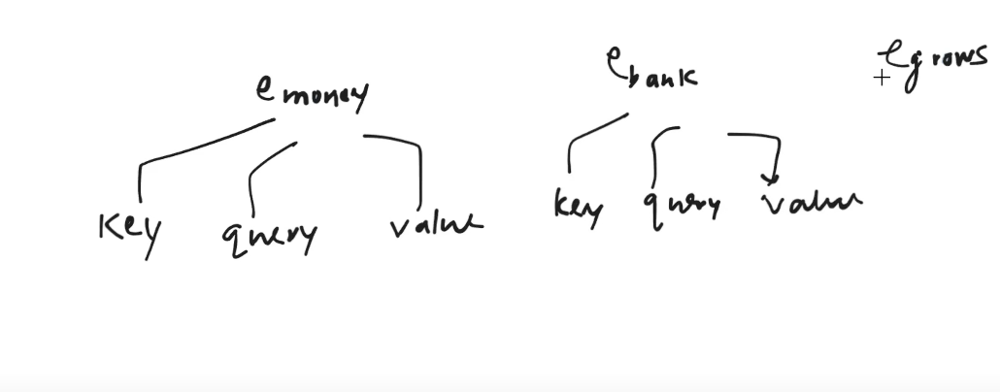
- But every vector is doing the roles itself
- At this stage, we need three vectors emerging out of each vector who will do the three tasks separately
- This is helpful in separation of tasks
- So we create three new vectors from each vector
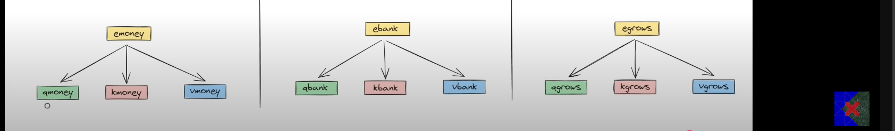

### The final picture
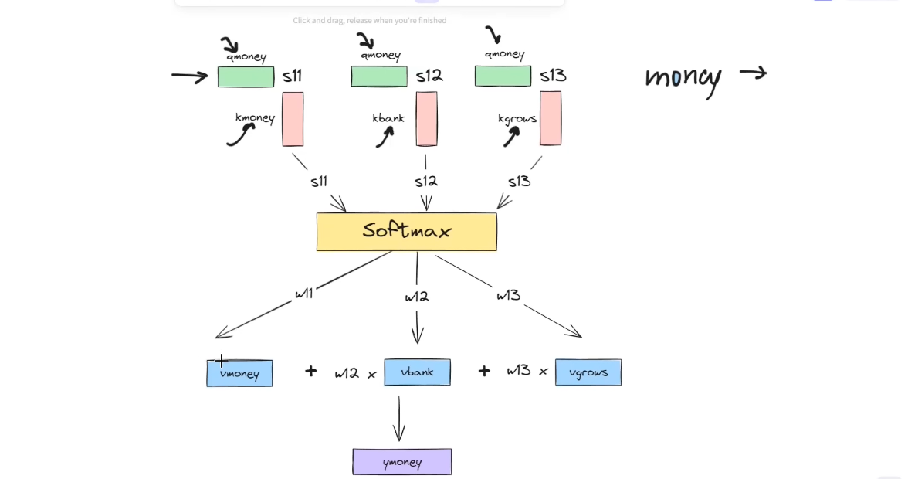

## How to Make Three Vectors From One Vector
- Do linear transformation (by multiplying with some matrices) to obtain new vectors
- The matrices (to be multiped by) are found during the training
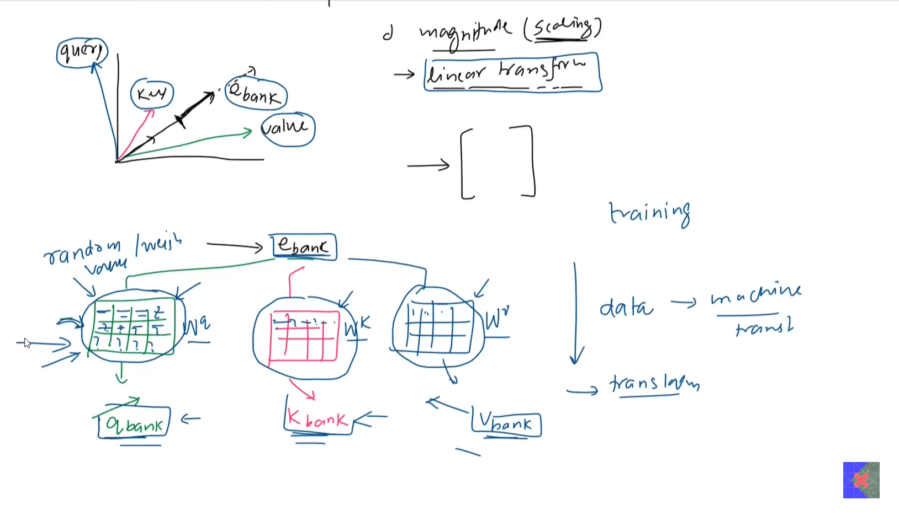
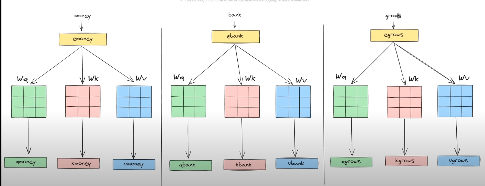
- The three multiplication vectors are same for all words

# FINAL
- Get raw embeddings
- Generate Query, Key and Value vectors from embeddings
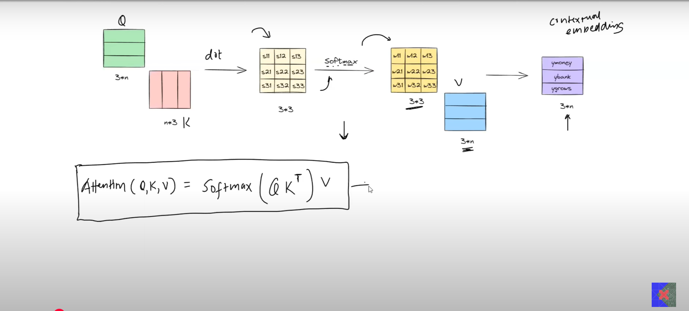

# Scaled Dot Product Attention

- dk is the dimensionality of the k (key) vector
- We scale the outputs because of the nature of dot product
- low dimensional vectors -> low variance
- high dimensional vectors -> high variance
- So if dimens
- This helps in stablizing the training